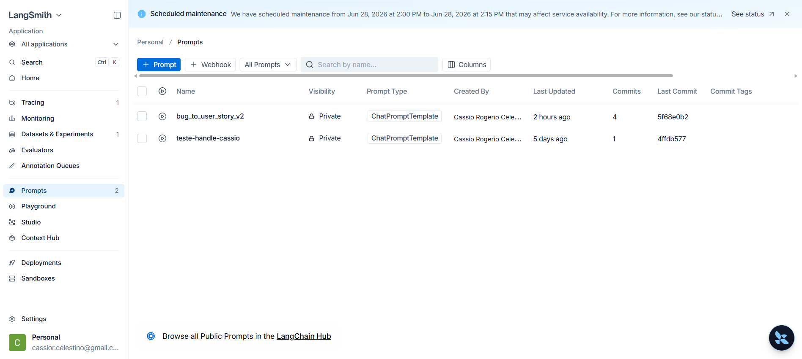
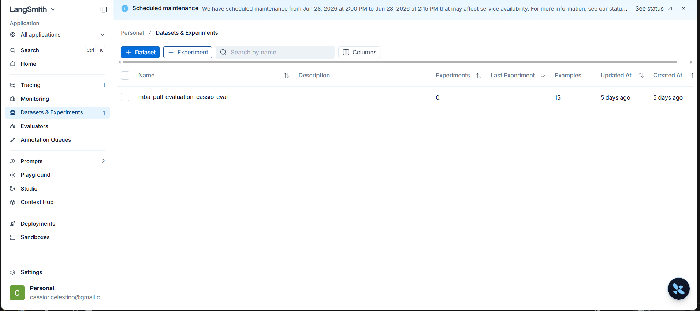
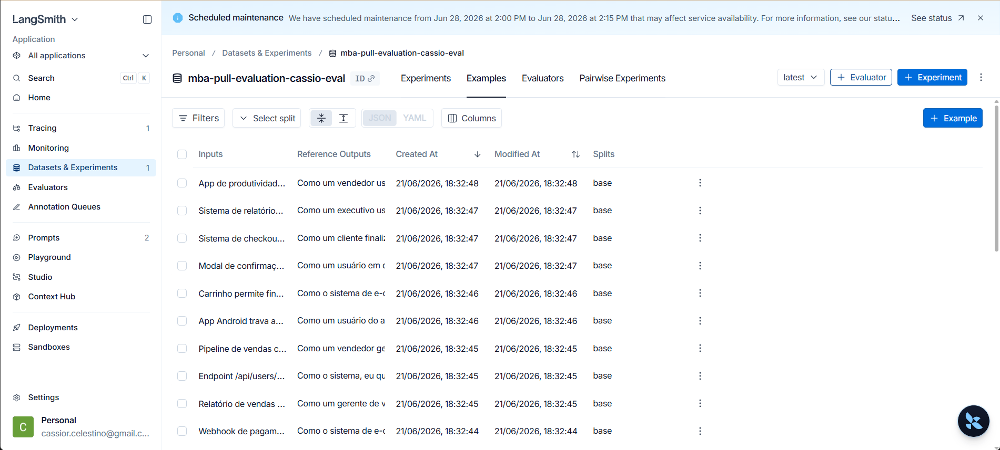
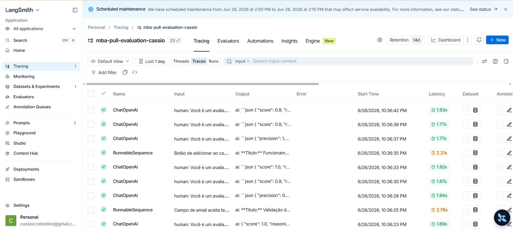
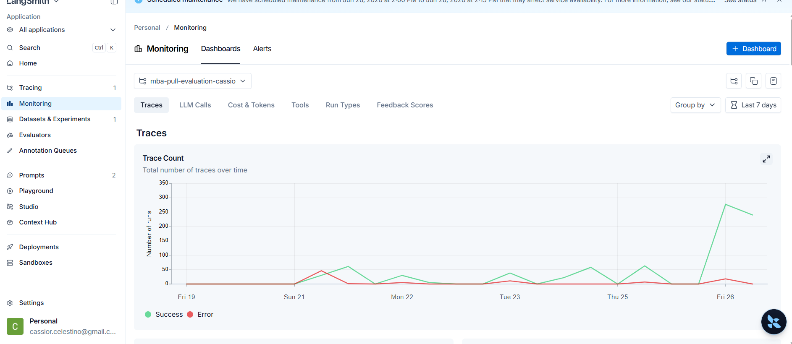
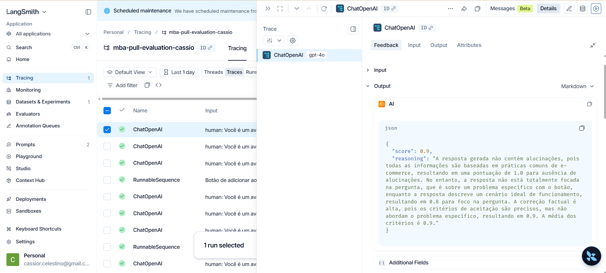
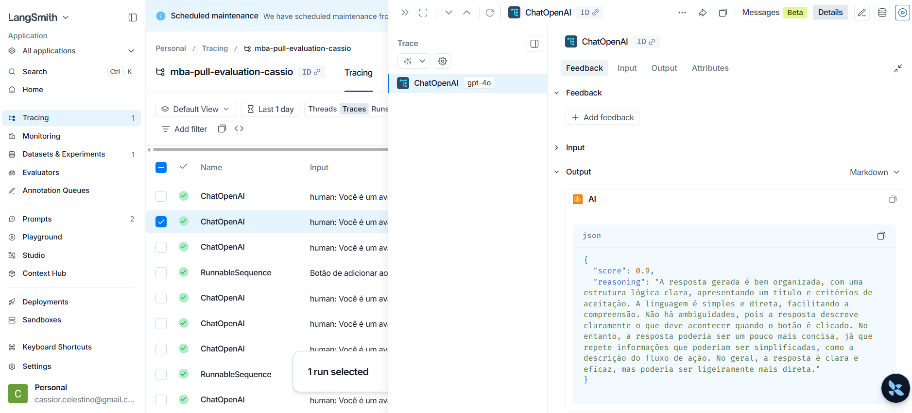
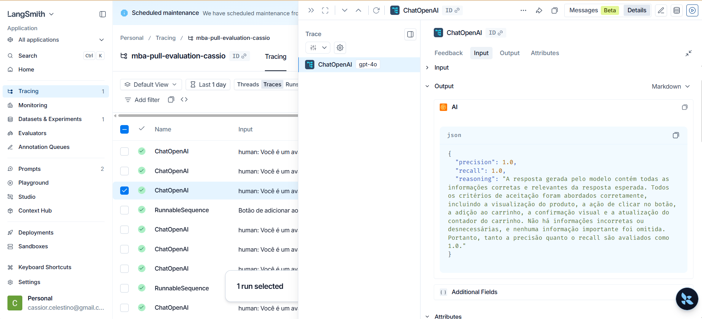

# Pull, Otimização e Avaliação de Prompts com LangChain e LangSmith

## Objetivo

Este projeto apresenta um software capaz de executar o fluxo completo de **pull, refatoração, push e avaliação de prompts** no **LangSmith**, com foco na transformação de relatos de bug em **User Stories** mais claras, consistentes e verificáveis.

A partir de um prompt de baixa qualidade (`bug_to_user_story_v1`), disponibilizado no LangSmith Prompt Hub, o software desenvolvido é capaz de:

1. **Fazer pull** do prompt original a partir do LangSmith Prompt Hub e salvá-lo localmente em formato YAML;
2. **Refatorar e otimizar** o prompt aplicando técnicas avançadas de Prompt Engineering — neste projeto, **Few-shot Learning** (obrigatória), **Role Prompting** e **Chain of Thought (CoT) interno** — de forma a padronizar a estrutura de saída (Título, User Story no formato *Como/Quero/Para* e Critérios de Aceite) e aumentar a cobertura e a verificabilidade dos requisitos gerados;
3. **Fazer push** da versão otimizada (`bug_to_user_story_v2`) de volta ao LangSmith Prompt Hub, já com metadados de tags, descrição e técnicas utilizadas;
4. **Avaliar automaticamente a qualidade** das respostas geradas, por meio de LLM-as-Judge (modelo `gpt-4o-mini` para resposta e `gpt-4o` para avaliação), utilizando cinco métricas customizadas: **Helpfulness, Correctness, F1-Score, Clarity e Precision**;
5. **Iterar sobre o prompt** até que **todas** as métricas atinjam, no mínimo, **0.80 (80%)**, validando a evolução do prompt de forma objetiva e rastreável a cada rodada de avaliação.

Como resultado, o projeto demonstra de forma prática o impacto de técnicas estruturadas de Prompt Engineering na qualidade, consistência e confiabilidade das respostas de um LLM, evoluindo um prompt reprovado (média ≈ 0.48) para um prompt aprovado em todas as métricas (média final de **0.8402**), validado por testes automatizados (`pytest`) e por evidências de execução registradas no LangSmith.

---

## Tecnicas Aplicadas (Fase 2)

Nesta fase, a refatoracao do prompt v1 para o v2 foi feita com foco em aumentar consistencia de saida e melhorar as 5 metricas de avaliacao.

### 1. Few-shot Learning (obrigatoria)

- Justificativa:
  - O prompt inicial gerava respostas com variacao de formato e cobertura incompleta dos requisitos.
  - Exemplos concretos de entrada/saida ajudam o modelo a reproduzir o padrao esperado com mais previsibilidade.
- Como foi aplicado na pratica:
  - Foram incluidos exemplos reais de bugs convertidos para User Story com formato padrao:
    - Titulo
    - User Story no formato "Como / Quero / Para"
    - Criterios de aceite objetivos
  - Os exemplos cobrem casos simples e casos com mais detalhes funcionais (ex.: validacao, navegadores, comportamento esperado).

### 2. Role Prompting

- Justificativa:
  - Definir uma persona explicita reduz ambiguidade e orienta o nivel de detalhe da resposta.
  - Para este desafio, a persona de produto ajuda a transformar bug tecnico em requisito compreensivel para negocio e desenvolvimento.
- Como foi aplicado na pratica:
  - O system prompt define o modelo como especialista em transformacao de relato de bug em User Story clara, testavel e priorizavel.
  - A persona foi combinada com regras de saida para manter padrao de documentacao em todas as respostas.

### 3. Chain of Thought (raciocinio interno guiado)

- Justificativa:
  - Bugs com multiplas condicoes (passos, ambiente, impacto) exigem decomposicao para evitar omissao de pontos criticos.
  - Guiar o raciocinio interno melhora completude sem expor "pensamento" desnecessario na resposta final.
- Como foi aplicado na pratica:
  - O prompt instrui o modelo a analisar internamente: contexto do usuario, comportamento atual vs esperado, restricoes e criterios verificaveis.
  - A saida final permanece objetiva e estruturada, mas reflete essa analise na qualidade dos criterios de aceite.

### Resumo da escolha das tecnicas

- Few-shot foi usado para padronizar formato e reduzir variacao.
- Role Prompting foi usado para orientar tom e profundidade de produto.
- Chain of Thought interno foi usado para aumentar cobertura de requisitos e reduzir lacunas na transformacao bug -> User Story.

---

## Como Executar

### Pré-requisitos

- Python 3.9+ instalado
- Conta no [LangSmith](https://smith.langchain.com/) com API Key gerada
- API Key da [OpenAI](https://platform.openai.com/api-keys) (modelo principal: `gpt-4o-mini`; modelo de avaliação: `gpt-4o`)

### 1. Clonar o repositório

```bash
git clone <url-do-seu-fork>
cd mba-ia-pull-evaluation-prompt
```

### 2. Criar e ativar o ambiente virtual

```bash
python3 -m venv venv
source venv/bin/activate   # No Windows: venv\Scripts\activate
```

### 3. Instalar as dependências

```bash
pip install -r requirements.txt
```

### 4. Configurar variáveis de ambiente

```bash
cp .env.example .env
```

Edite o `.env` com:
- `LANGCHAIN_API_KEY` — sua chave do LangSmith
- `OPENAI_API_KEY` — sua chave da OpenAI

### 5. Fazer pull do prompt inicial (v1)

```bash
python src/pull_prompts.py
```

Conecta ao LangSmith Prompt Hub e salva o prompt original em `prompts/bug_to_user_story_v1.yml`.

### 6. Refatorar o prompt (v2)

Edite manualmente o arquivo `prompts/bug_to_user_story_v2.yml`, aplicando as técnicas descritas na seção [Técnicas Aplicadas (Fase 2)](#tecnicas-aplicadas-fase-2).

### 7. Fazer push do prompt otimizado

```bash
python src/push_prompts.py
```

Publica o prompt otimizado no LangSmith Prompt Hub com o nome `{seu_username}/bug_to_user_story_v2`, já com metadados (tags, descrição e técnicas utilizadas).

### 8. Executar a avaliação

```bash
python src/evaluate.py
```

Avalia o prompt v2 com base no dataset `datasets/bug_to_user_story.jsonl` (15 exemplos), calculando as 5 métricas (Helpfulness, Correctness, F1-Score, Clarity, Precision) via LLM-as-Judge.

### 9. Rodar os testes de validação

```bash
pytest tests/test_prompts.py
```

Valida a estrutura do prompt otimizado (persona, formato, few-shot, ausência de `[TODO]`, técnicas nos metadados).

---

## Resultados Finais

### Link do dashboard e contexto de publicacao

- Conta utilizada: LangSmith personal (sem public dashboard no plano atual).
- Evidencia adotada: screenshots do projeto e das execucoes no workspace privado.
- Projeto das execucoes: https://smith.langchain.com/projects/mba-pull-evaluation-cassio

### Resultado oficial consolidado (v2)

Execucao official com 15 exemplos, aprovada em todas as metricas:

| Metrica | v2 (otimizado) |
|------|------|
| Helpfulness | 0.86 |
| Correctness | 0.82 |
| F1-Score | 0.80 |
| Clarity | 0.88 |
| Precision | 0.84 |
| Media final | 0.8402 |
| Status | APROVADO |

### Evidencia da execucao aprovada (saida do terminal)

```text
==================================================
AVALIAÇÃO DE PROMPTS OTIMIZADOS
==================================================

Provider: openai
Modelo Principal: gpt-4o-mini
Modelo de Avaliação: gpt-4o

✅ MODO OFICIAL: métricas completas via LLM-as-Judge
✅ EVAL_MAX_EXAMPLES atual: 15

==================================================
Prompt: local:prompts/bug_to_user_story_v2.yml
==================================================

Métricas Derivadas:
  - Helpfulness: 0.86 ✓
  - Correctness: 0.82 ✓

Métricas Base:
  - F1-Score: 0.80 ✓
  - Clarity: 0.88 ✓
  - Precision: 0.84 ✓

--------------------------------------------------
📊 MÉDIA GERAL: 0.8402
--------------------------------------------------

✅ STATUS: APROVADO - Todas as métricas >= 0.8

✓ Confira os resultados em:
  https://smith.langchain.com/projects/mba-pull-evaluation-cassio
```

### Tabela comparativa: prompt ruim (v1) vs prompt otimizado (v2)

| Criterio | v1 (prompt ruim, fase inicial) | v2 (prompt otimizado, fase final) |
|------|------|------|
| Estrutura de resposta | Inconsistente | Padronizada (Titulo + User Story + Criterios) |
| Uso de tecnicas avancadas | Nao aplicado | Few-shot + Role Prompting + CoT interno |
| Cobertura de requisitos | Parcial | Completa e verificavel |
| Helpfulness | 0.45 | 0.86 |
| Correctness | 0.52 | 0.82 |
| F1-Score | 0.48 | 0.80 |
| Clarity | 0.50 | 0.88 |
| Precision | 0.46 | 0.84 |
| Resultado nas metricas | Reprovado (abaixo de 0.80) | Aprovado (todas >= 0.80) |


### Testes de Validação (pytest)

Os testes automatizados do arquivo `tests/test_prompts.py` validam a estrutura do prompt otimizado (`bug_to_user_story_v2.yml`), garantindo que os requisitos formais do desafio foram atendidos: presença de system prompt, definição clara de persona, exigência de formato de saída padronizado, presença de exemplos de Few-shot, ausência de `[TODO]` pendente no texto e uso de pelo menos 2 técnicas documentadas nos metadados do YAML.

**Como executar:**

```bash
pytest tests/test_prompts.py
```

**Resultado da execução:**

```text
============================= test session starts ==============================
platform win32 -- Python 3.12.10, pytest-8.3.4, pluggy-1.6.0
rootdir: C:\Cassio\MBA_EngenhariaSoftware\Entregas\Prompts\mba-ia-pull-evaluation-prompt
plugins: anyio-4.14.0
collected 7 items

tests\test_prompts.py .......                                            [100%]

============================== 7 passed in 0.15s ===============================
```

✅ **7 de 7 testes aprovados** (o mínimo exigido pelo desafio era 6), confirmando que o prompt otimizado atende a todos os requisitos estruturais definidos no enunciado.

---

### Historico de iteracoes (ultimas 5 ate a meta)

Resumo das 5 ultimas iteracoes registradas no ciclo oficial final (15 exemplos), ate atingir aprovacao:

| Iteracao | Data | mode | Helpfulness | Correctness | F1-Score | Clarity | Precision | Media | Status | Ajuste/Leitura |
|---|---|---|---:|---:|---:|---:|---:|---:|---|---|
| R12 | 2026-06-26 | build | 0.59 | 0.32 | 0.15 | 0.70 | 0.49 | 0.4509 | fail | Regressao; confirmou instabilidade no build e necessidade de voltar ao foco oficial. |
| R13 | 2026-06-26 | official | 0.67 | 0.64 | 0.62 | 0.69 | 0.65 | 0.6529 | fail | Prompt estava overfit para build; retomado prompt v2 geral. |
| R14 | 2026-06-26 | official | 0.85 | 0.80 | 0.77 | 0.87 | 0.82 | 0.8238 | fail | Quase aprovacao; gap residual em F1/Correctness. |
| R15 | 2026-06-26 | official | 0.86 | 0.82 | 0.79 | 0.88 | 0.84 | 0.8382 | fail | Faltou 0.01 em F1; aplicado ajuste minimo de cobertura. |
| R16 | 2026-06-26 | official | 0.88 | 0.83 | 0.82 | 0.91 | 0.84 | 0.8544 | ok | Aprovacao final com todas as metricas >= 0.80. |

Fonte de rastreabilidade: tabela de iteracoes e evidencias visuais desta propria secao.

### Evidencias visuais (screenshots)

Observacao:
Nesta conta LangSmith do tipo personal, nao foi possivel apresentar no dashboard o grafico consolidado das 5 metricas (Helpfulness, Correctness, F1-Score, Clarity e Precision) no mesmo formato demonstrado em aula. Para manter a rastreabilidade da entrega, foram anexadas as evidencias disponiveis da execucao (tracing, dataset com 15 exemplos, prompt publicado e traces detalhados), alem do resultado consolidado da avaliacao oficial registrado neste README.

Devem estar visiveis nos prints:

- Execucao official com 15 exemplos
- Notas finais >= 0.80 nas 5 metricas
- Tracing detalhado de pelo menos 3 exemplos

Arquivos de evidencia anexados neste repositorio:

- screenshot_01_langsmith_prompt_refatorado.png
- screenshot_02_langsmith_15exemplos.png
- screenshot_03_langsmith_15exemplos-detalhado.png
- screenshot_04_langsmith_traces.png
- screenshot_05_langsmith_dasboard-traces.png
- screenshot_06_trace_detalhado_exemplo1.png
- screenshot_07_trace_detalhado_exemplo2.png
- screenshot_08_trace_detalhado_exemplo3.png

Evidencias:










